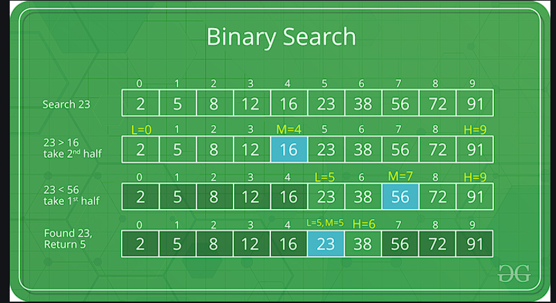
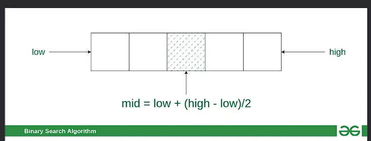
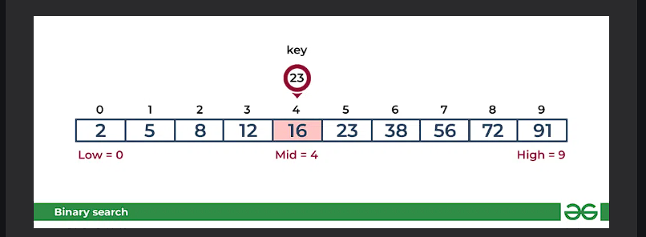
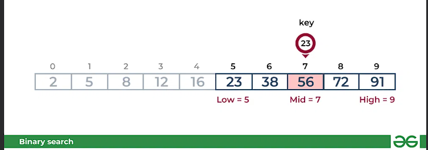
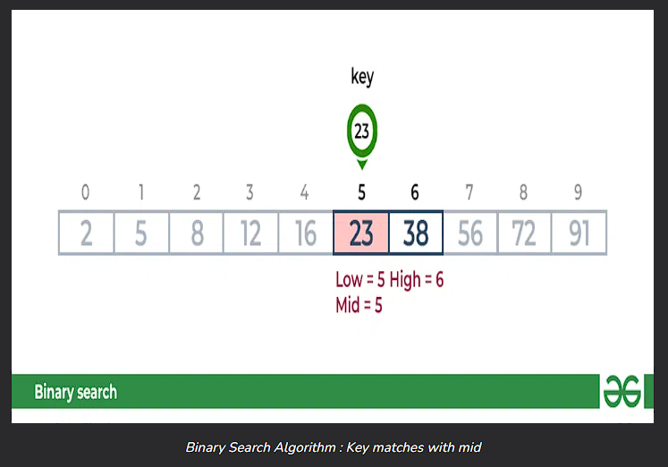

# Binary Search -Data Structure and Algorithm 
---------------

Binary Search id defined as Searching algorithm used in a stored array by repeatedly dividing the search interval in half . Ther idea of binary search is to use the information that the array is sorted and refuce the time complexity to O (log N)




# Conditions for when to apply Binary Search in a Data Structure :
to apply Binary Search algorithm::
* The data structure must be sorted 
* Access to any element of the data Structure takes constant time 

## Binary Search algorithm::
* Divide the search space into two halves by  finding the middle index "mid".



* Compare the middle element of the search space with the key .
* if the key is found at middle element , the process is terminated 
* if the key is not found at middle element , chose which half will be used as the next search space . 
    * if the key is smaller than the middle element , then the left side is used for next search . 
    * if the key is larger than the middle element , then the right side is uded for next search. 
* this process is continued until the key is found or the total search space is exhasted.
-------

# How does Binary search work?
    
    to understand the working of the binary search , consider the following illustration 


```
consider an array arr[]={2, 5, 8, 12, 16, 23, 38, 56, 72, 91}, and the first target=23


```
### First Step:- 
Calculate the mind and compare the mid element with the key is less than mid element , move to left and if it is greater than the mid then move search space to the right . 
* Key(ie,23) is greater than current mid element (ie,.16).The search space moves to the right . 



* Key is less than the current mid 56. The search space moves to the left . 



## Second Step : 
if the key matches the value of the mid element, the element is found and stop search . 



# How to implement Binary Search?
the **Binary Search Algorithm** can be implemented in the following two ways 

* iterative Binary Search Algorithm 
* Recursive Binary Search Algorithm 

Given below are the pseudocodes for the approaches . 
# 1. Iterative Binary Search Algorithn::
-------
Here we use a while loop to continue the process of comparing the key splitting space in two halves . 
-------
```
then  go to the main.py for the reference .....

```
### 2. Recursive Binary Searrch Algorithm:

-----
creat a recursive function and compare the mid of the search space with the key. And based on the result either return the index where the key is found or call the recursive function for the next search space . 


----

```
reference the second.py file for recursive ...
```

# complexity Anakysis of Binary Search 
------------
* ## Time complexity:
    * Best case:o(1)
    * Avarage Case:O(log N)
    * Worst case :O(log N)
* ## Auxiliary Space :
    * O(1) if the recursice call stack is considered then the auxiliary space will be O(logN)

# Advantages of Binary Search :
* Binary search is faster than linear search , especially for large arrays,
* More efficient than other searching algorithms with a similar time complexity , such as interpolation search or exponential search . 
* Binary search is well-suited for searching large datasets that are stored in external memory , such as on a hard drive or in the cloud 

# Drawbacks of Binary Search:
* The array should be sorted 
* Binary search requires that the data structure being searched be stored in contiguous memory locations. 
* Binary search requires that the elements of the array the be comparable , meaning that they must be able to be ordered . 
