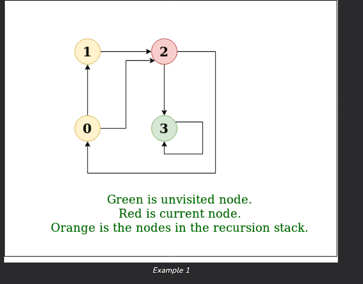

# Depth First Search or DFS for a Graph
--------
<b>Depth First Traversal (or DFS)<b> for a graph is similar to Depth First Traversal of a tree . the only catch here is , that , unlike trees, graphs may contain cycles (a node may be visited twice ). To avoid processing a node more than once , use a boolean visited array. A graph can have more than one DFS traversal . 

**Example** 
--------
input :n=4, e=6
0-> 1,0->2,1->2,2->0,2->3,3->3
**Output**: DFS from vertex 1:1 2 0 3
**Explanation**:
**DFS Digram:**

--------

## How does DFS work?

Depth-first search is an algorithm for traversing or searching tree or graph data stractures. The algorithm starts at the root node (selecting some arbitary node as the root node in the case of graph ) and explores as far as possible along each branch before backtracking.

Let us understand the working of Depth First Search  with the help of the following illustration . 

-------
**step1:** :Initially stack and visited arrays are empty .

-------------

----------
**step2:**:Visit 0 and put its adjacent nodes which are not visited yet into the stack . 

----------

-------
**step3**:Now , node 1 at the top of the stack , so visit node 1 and pop if from the stack and put all of its adjacent node which are not visited in the stack . 

-------
