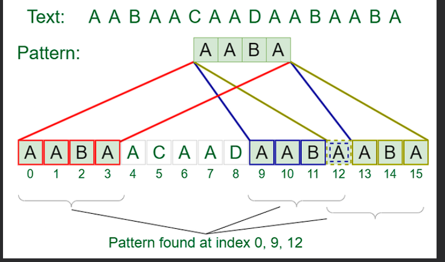

# Knuth-Morris-Pratt KMP String Matching Algorithm
------


Given a text **txt[0...N-1]** and a pattern **pat[0...M-1]**,write a function search (char pat[],char[]) that prints all occurrences of pat[]in txt[].You may assume that **N>M** 

## Example:
-----------
```
input:txt[]="THIS IS A TEST TEXT", pat[]='TEST'
Output: Pattern found at index 10

Input:txt[]= 'AABAACAADAABAABA'
      pat[]='AABA'

Output:Pattern found at index 0, pattern found at index 9, pattern found at index 12
```



-----
pattern searching is an important problem in computer science . when we do seach for a string in a notepad/word file or browser or database. 
pattern-searching algorithms are used to show the search results. 

the worst case complexity of the Naive algorithm is O(m(n-m+1).
the time complexity of the KMP algorithm is O(n+m) in the worst case . 

# KMP (knuth Morris Pratt) Pattern Searching:
The <u>Naive-pattern-searching algorithm</u> doesn't work well in case where we see many matching charecters followed by a mismatching charecter. 

## Example
```
1) txt[]='AAAAAAAAAAAAAAAAAB',pat[]='AAAAB'
2) txt[]='ABABABCABABABCABABABC', pat[] =  “ABABAC” (not a worst case, but a bad case for Naive)

```

The KMP matching algorithm uses degenerating property (pattern having the same sub-patterns appearing more than once in the pattern) of the pattern and improves the worst-case complexity to **O(m+n)**.

The basic idea behind KMP's algorithm is : whenever we detect a mismatch (after some matches ),we already know some of the charecters in the text of the next window , We take advantage of this information to avoid matching the characters that we know will anyway match . 


```
txt = “AAAAABAAABA” 
pat = “AAAA”
We compare first window of txt with pat

txt = “AAAAABAAABA” 
pat = “AAAA”  [Initial position]
We find a match. This is same as Naive String Matching.

In the next step, we compare next window of txt with pat.

txt = “AAAAABAAABA” 
pat =  “AAAA” [Pattern shifted one position]

This is where KMP does optimization over Naive. In this second window, we only compare fourth A of pattern
with fourth character of current window of text to decide whether current window matches or not. Since we know 
first three characters will anyway match, we skipped matching first three characters. 

Need of Preprocessing?

An important question arises from the above explanation, how to know how many characters to be skipped. To know this, 
we pre-process pattern and prepare an integer array lps[] that tells us the count of characters to be skipped
```


### Preprocessing Overview::

* KMP algorithm preprocess pat[] and constructs an axiliary **lpx[]** of size **m** (same as the size of the pattern ) which is used to skip charecters while matching .
* Name **lps** indicates the longest proper prefix which is also a suffix. A proper prefix of "ABC" are "",'A','AB' and "ABC".proper prefixes are "",'A' and 'AB' . Suffixes of the string are "",'C',"BC" and 'ABC'
* We search for lps in subpatterns . More clearly we focus on sub stings of patterns that are both prefix and suffix 
* for each sub-pattern pat[0] where i=0 to m-1 ,lps[i] stores the length of the maximum matching proper prefix which is also a suffix of th esub-pattern pat[0..i]

```
lps[i]= the longest proper prefix of pat[0,i] which is also a suffix of pat [0..i]

```
**NOTE**: lps[i] could also be defined as the longest prefix which is also a proper suffix . we need to use it properly in one place to make sure that the whole substring not considered 

examples of lps[] construction :
```
for the patters"AAAA",lps[]is [0,1,2,3]
For the pattern "ABCD",lps[] is [0,0,0,0,0]
For the pattern “AABAACAABAA”, lps[] is [0, 1, 0, 1, 2, 0, 1, 2, 3, 4, 5]
For the pattern “AAACAAAAAC”, lps[] is [0, 1, 2, 0, 1, 2, 3, 3, 3, 4] 

For the pattern “AAABAAA”, lps[] is [0, 1, 2, 0, 1, 2, 3]
```
```
    def KMPsearch(pat,txt):
        M=len(pat)
        N=len(txt)

        #create lps[] that will hold the longest prefix sucffix 
        # create for pattern
        lps=[0]*M
        j=0 #index for pat[]

        #preprocess the pattern (calculate lps[] array)
        computeLPsArray(pat,M,lps)

        i=0
        while (N-i)>=(M-j):
            if pat[j]==txt[i]:
                i+=1
                j+=1
            
            if j==M:
                print("found pattern at index"+ str(i-j))
                j=lps[j-1]
            
            elif i< N and pat[j]!=txt[i]:
                #do not match lps[0..lps[j-1]] charecters , 
                # they will match anyway 
                if j !=0:
                    j=lps[j-1]
                else:
                    i+= 1
    #function to compute LPS array
    def computeLPSArray(pat, M, lps):
        len=0 #length of the previous longest prefix suffix
        lps[0]=0
        i=1

        #the loop calculate lps[i] for i =1 to M-1

        while i<M:
            if pat[i]==pat[len]:
                len+=1
                lps[i]=len
                i+=1
            else:
                #this is tricky . consider the example 
                #AAACAAAA and i=7 . the idea is similar 
                # to search steps
                if len !=0:
                    len =lps[len-1]

                    #also , note that we do not increment i here 
                else:
                    lps[i]=o
                    i+=1

    #Driver code 
    if __name__=='__main__':
        txt="ABABDABACDABABCABAB"
        Pat="ABABCABAB"
        KMPSearch(pat,txt)


```


# output
```
found pattern at index 10

```

**Time Complexity**:O(N+M) where N is the length of the text and M is the length of the pattern to be found. 

**Auxilary Space:**O(M)

